# 🔥 Теплосеть

## 📸 Скриншоты

### 🔐 Авторизация и регистрация

| Вход в систему | Регистрация |
|----------------|-------------|
|  | 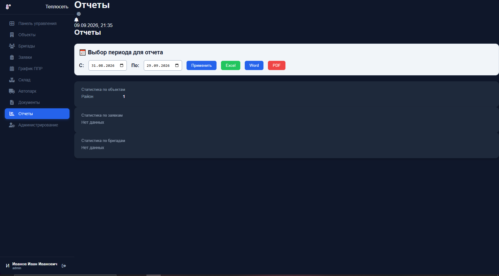 |

---

### 📊 Панель управления (дашборд)

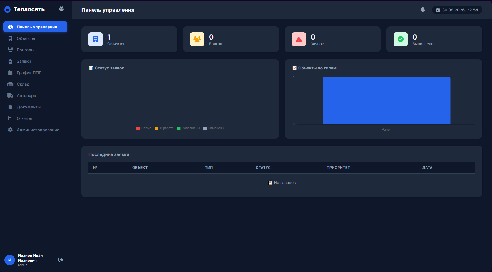

---

### 🏗️ Управление объектами

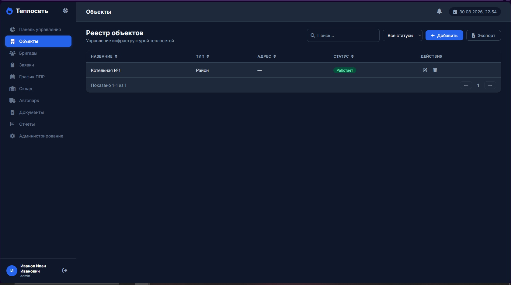

---

### 👷 Управление бригадами

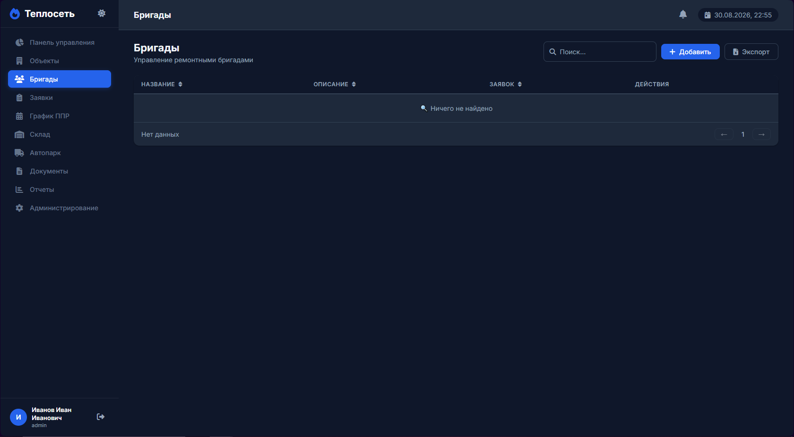

---

### 📋 Управление заявками

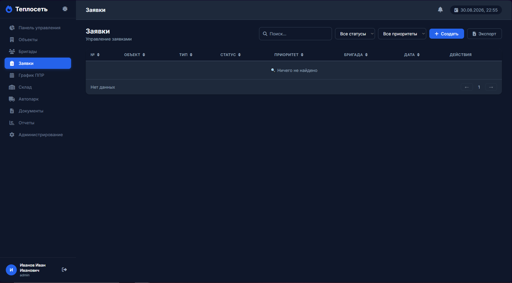

---

### 📦 Склад

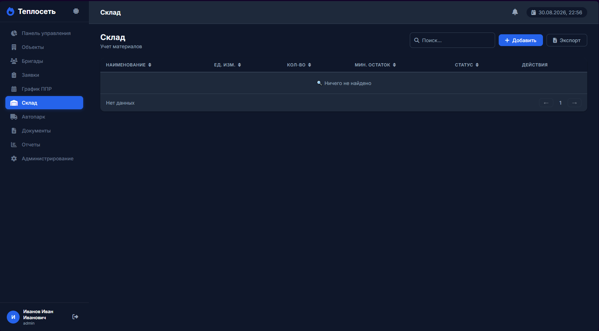

---

### 🚗 Автопарк

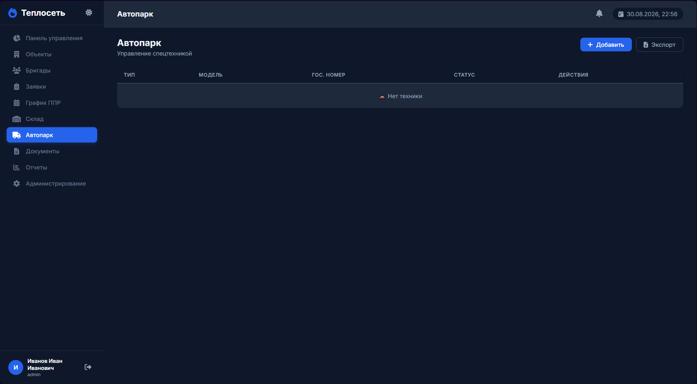

---

### 📄 Документы

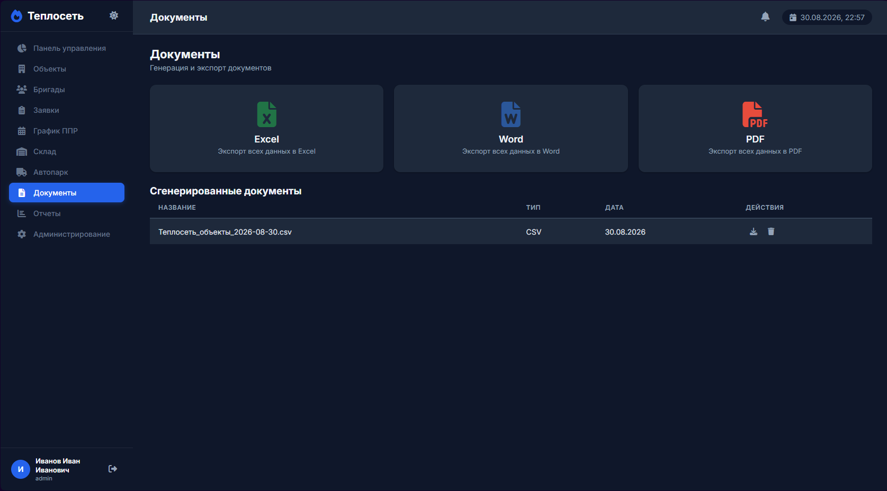

---

### 📈 Отчеты

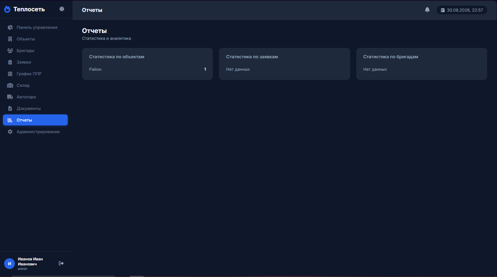

---

### Администрирование

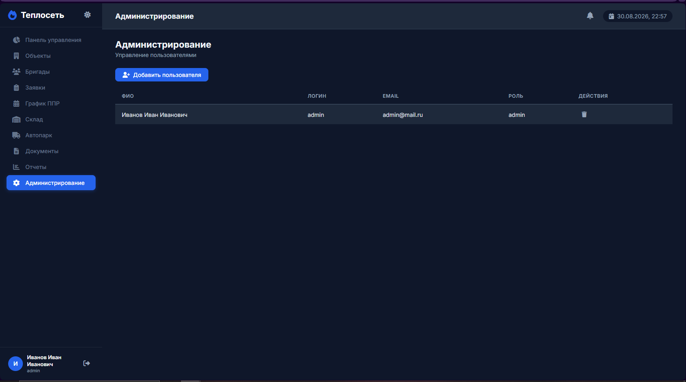

---

### Графики

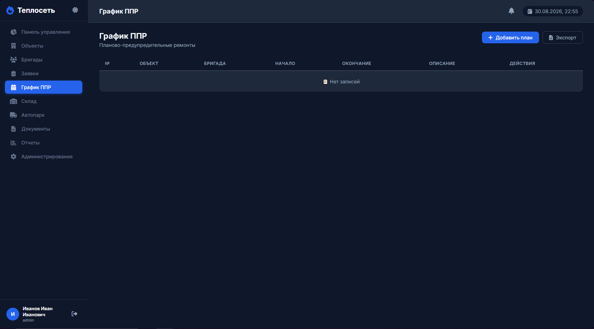

---

Управление теплосетями — полноценное веб-приложение для учета объектов, бригад, заявок, склада и автопарка.

---

## 🚀 Функционал

| № | Функция | Описание |
|---|---------|----------|
| 1 | 🔐 Авторизация/Регистрация | Вход и регистрация пользователей с разными ролями |
| 2 | 🏗️ Объекты | CRUD + поиск + фильтры по статусу |
| 3 | 👷 Бригады | CRUD + поиск + счетчик заявок |
| 4 | 📋 Заявки | CRUD + поиск + фильтры + смена статуса |
| 5 | 📅 График ППР | Планово-предупредительные ремонты |
| 6 | 📦 Склад | CRUD + поиск + пагинация + статус запасов |
| 7 | 🚗 Автопарк | CRUD + статус техники |
| 8 | 📄 Документы | Экспорт в Excel, Word, PDF |
| 9 | 📊 Отчеты | Статистика и аналитика |
| 10 | 🌙 Темная тема | Переключение светлой/темной темы |
| 11 | 📱 Адаптив | Работает на всех устройствах |
| 12 | 🔍 Поиск и фильтры | Быстрый поиск по всем таблицам |
| 13 | 📄 Пагинация | Разбивка таблиц по 10 записей |
| 14 | 🔽 Сортировка | Сортировка по клику на заголовок |

---

## 🛠️ Технологии

| Технология | Назначение |
|------------|------------|
| HTML5 | Структура приложения |
| CSS3 | Стилизация + адаптив |
| JavaScript (ES6) | Логика приложения |
| Chart.js | Графики на дашборде |
| XLSX | Экспорт в Excel |
| jsPDF + AutoTable | Экспорт в PDF |
| localStorage | Хранение данных |

---

## 🏃 Как запустить

1. Скачай все файлы проекта
2. Открой `index.html` в любом браузере
3. Зарегистрируйся или войди с существующим логином
4. Наслаждайся работой! 🚀

---

## 👤 Сотрудники и доступы

### 🔐 Администраторы (полный доступ)

| ФИО | Логин | Пароль | Роль |
|-----|-------|--------|------|
| Иванов Иван Иванович | admin | 1234 | Администратор |
| Петрова Анна Сергеевна | petrova | 123 | Администратор |

---

### 📊 Диспетчеры (управление заявками)

| ФИО | Логин | Пароль | Роль |
|-----|-------|--------|------|
| Смирнов Алексей Дмитриевич | smirnov | 123 | Диспетчер |
| Кузнецова Елена Владимировна | kuznetsova | 123 | Диспетчер |

---

### 👷 Мастера (руководство бригадами)

| ФИО | Логин | Пароль | Роль |
|-----|-------|--------|------|
| Соколов Дмитрий Петрович | sokolov | 123 | Мастер |
| Попов Андрей Николаевич | popov | 123 | Мастер |
| Зайцев Сергей Михайлович | zaytsev | 123 | Мастер |

---

### 📦 Кладовщики (учет материалов)

| ФИО | Логин | Пароль | Роль |
|-----|-------|--------|------|
| Федорова Ольга Игоревна | fedorova | 123 | Кладовщик |
| Морозов Денис Александрович | morozov | 123 | Кладовщик |

---

### 🚗 Механики (автопарк)

| ФИО | Логин | Пароль | Роль |
|-----|-------|--------|------|
| Волков Роман Сергеевич | volkov | 123 | Механик |
| Лебедев Павел Николаевич | lebedev | 123 | Механик |

---

### 📋 Руководители (отчеты и аналитика)

| ФИО | Логин | Пароль | Роль |
|-----|-------|--------|------|
| Новикова Татьяна Михайловна | novikova | 123 | Руководитель |
| Козлов Игорь Васильевич | kozlov | 123 | Руководитель |
